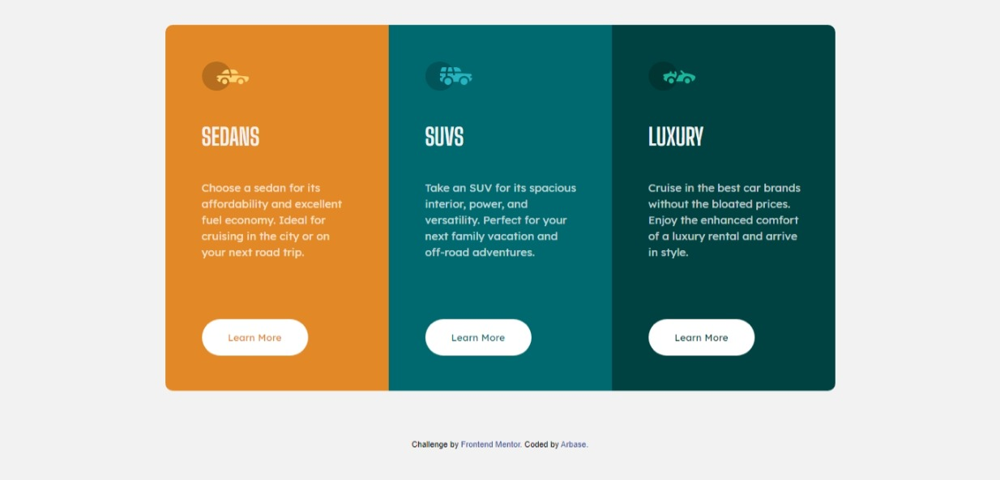

# Frontend Mentor - 3-column preview card component solution

This is a solution to the [3-column preview card component challenge on Frontend Mentor](https://www.frontendmentor.io/challenges/3column-preview-card-component-pH92eAR2-). Frontend Mentor challenges help you improve your coding skills by building realistic projects. 

## Table of contents
  - [The challenge](#the-challenge)
  - [Screenshot](#screenshot)
  - [Links](#links)
- [My process](#my-process)
  - [Built with](#built-with)
- [Author](#author)
- [Acknowledgments](#acknowledgments)

### The challenge

Users should be able to:

- View the optimal layout depending on their device's screen size
- See hover states for interactive elements

### Screenshot

### Links

- Solution URL: [Frontendmentor Solution](https://www.frontendmentor.io/challenges/3column-preview-card-component-pH92eAR2-/hub/mobile-first-3-column-preview-card-using-css-flexbox-S1tVl0jSO)
- Live Site URL: [3 Column Preview Card - GitHub Pages](https://arbase.github.io/3-column-card/)

## My process

  I finished this project in a day and I think I don't have any problem during this challenge

### Built with

- CSS custom properties
- Flexbox
- Mobile-first workflow

## Author

- Website - [Arbase](https://www.arbase.github.io)
- Frontend Mentor - [@arbase](https://www.frontendmentor.io/profile/arbase)
- Twitter - [@arbase_](https://www.twitter.com/arbase_)

## Acknowledgments

Thanks to frontendmentor.io for providing this challenge.